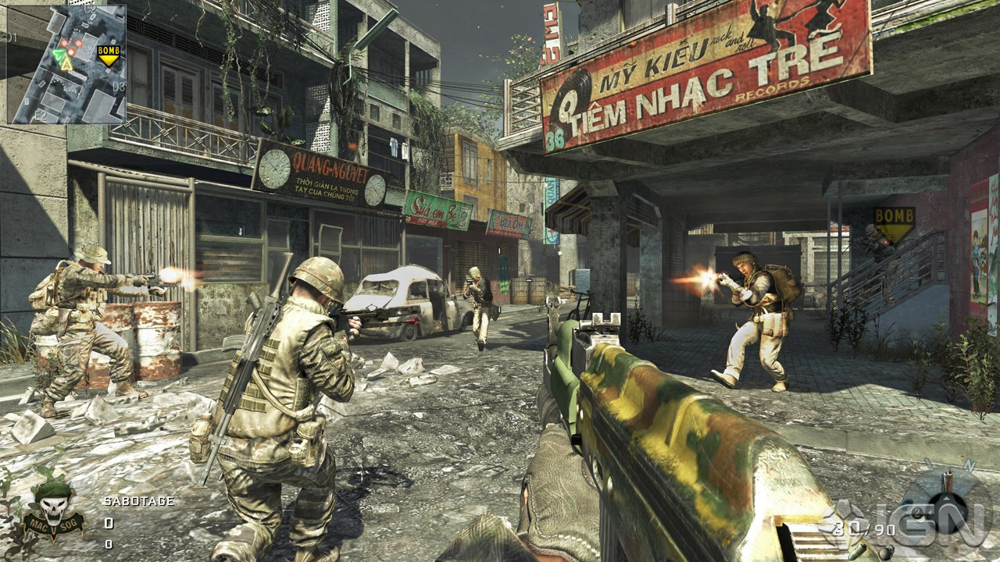
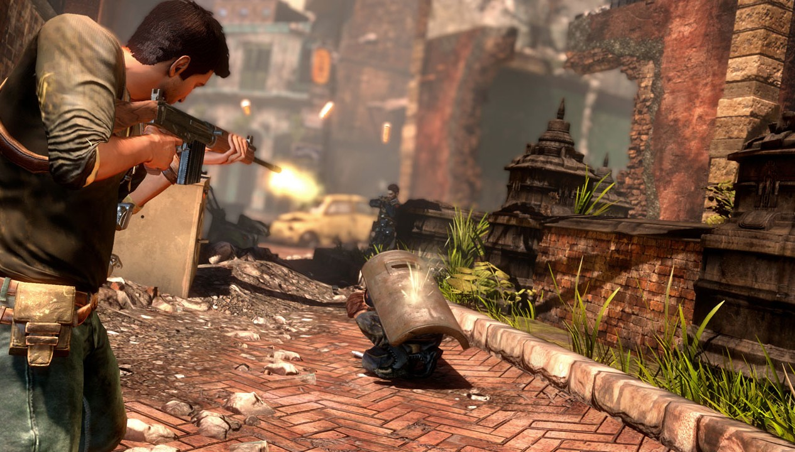
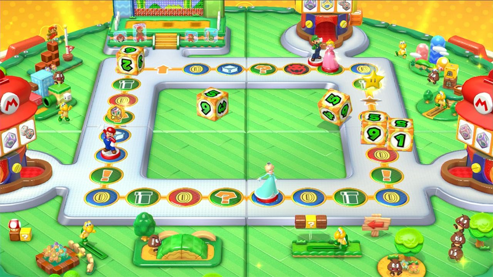

# Research Conducted

In this chapter I will present all the relevant research relating to the project that has been conducted.
This includes research of the Unity engine, games developed in the engine, networked and non-networked multi-player games,
and the different genres of video-games.

## Unity and Video Game Engines
Almost every one on planet earth has probably come into contact with video games at some point in their life, whether it 
through playing them, watching someone else play them or even seeing a movie previously based off of a video game. Yes,
it is impossible to avoid video games on modern society. But how exactly are video games made? How does what you interact with
on screen from traversing through space, to saving your princess from castle to castle, to even playing a virtual sport 
without ever having to leave your house made possible? It's simple really, these are all made possible through the software 
frameworks which are video game engines. These engines are used to design the video games in which you play on your consoles,
your PCs and even your mobile devices. These frameworks provide for you, the tools to make your video game such as, the physics
of your game, the animations, the scripting and the AI. Popular video game engines include the Frostbite engine, the Unreal
engine, and of course the Unity engine.
 
The Unity Engine was first announced in 2005 originally only to be used on Mac OS due to its popularity it has since been
extended to 27 platforms such as Desktop, Games Consoles, Virtual Reality and even Smart Tv's.
The popularity of the platform increased even more with the launch of Unity 5 in 2015 with more than 5 billion games 
developed in Unity downloaded in the third quarter of 2016 alone, with the technology being popular among developers more
than any other third party game development software, with developers including the likes of Ubisoft, Square Enix, Warner Bros,
Obsidian and even Coca Cola.
  
Many popular games in today's gaming culture have been developed in Unity including the likes of, Slender: The Eight Pages, 
a popular survival horror game in which a player must collect eight pages scattered throughout a map all while avoiding 
someone who is following them. 7 Days to Die, another survival horror game set in an open world where the player must craft and
survive in the wilderness while fighting against zombies. Cities Skylines, a simulator in which the user builds entire cities and 
the rules in which the city operates, and recently the extremely popular mobile game Pokemon GO was developed in Unity, a 
game in which you walk around with your phone and then encounter Pokemon and use the camera in your phone to capture them.

All of this shows that there are many different features in which can be implemented into games made using this engine and
just how creative a developer can be when developing a game which is one the goals of my project was to try make the game
as creative as possible.

## Multi-Player Video Games
Multi-Player is one of the most significant features incorporated into video games today. Recent demographics show that 
56% of gamers in America play games predominantly with other players, while 54% of gamers play a multi-player game weekly.
But what is a multi-player game? What makes them so predominantly played and what types of multi-player games are there?

A multi-player game is a video game in which two or more people can play the same game, in the same environment simultaneously.
Depending on the nature of the game, the two players can either be playing as part of a team, or can be playing as foes.
There are two ways in which a multi-player game can be achieved; either through a non-networked system, or a networked system.

*Non-Networked* multi-player games are games which do not require an online internet connection for people to play with 
each other. One of the earliest games that became popular for its multi-player game-play was the sports game "Pong".
First released in 1972, "pong" (See Figure \ref{pong}) was a game in which two players would hit a ball between them in an effort to try and knock
the ball past their opponents in order to score points, similar to that of table tennis.

*Networked* multi-player games are games in which an online internet connection is required and in real time the game is played
with multiple other users. These type of games have become very popular in recent times through the success of first person 
shooters such as the "Call of Duty" (See Figure \ref{callofduty}) series and the "Battlefield" series. The purpose of these games is that you compete against 
other players in different game types, which have different goals. But the ultimate goal in most game types is the player or team
with the most kills wins.

## Genres of Video-Games
There were many different genres of video games to consider when developing my game and which genre would be best suited to
the game I was trying to make. Some of these genres included

###Action-Adventure Games

Action-Adventure games are games which contain both a mix of games from the action genre and the adventure genre such as puzzles and scenes
where your character must have to fight their way out of a situation. This genre may require the skills that are involved with
playing through an action game, but also share's some of its elements from adventure games like a story line, inventory system
and multiple characters. Some popular action-adventure games include the likes of the Tomb Raider series and the Uncharted (See Figure \ref{uncharted})
series.

###Party Games

Party games are video-games that are normally developed solely for multi-player use to play either locally or online with friends.
They are commonly designed as a collection of simple mini-games, designed to be intuitive and easy to play. Examples of these
video-games are games such as Mario Party (See Figure \ref{marioparty}) and the Jackbox collection

###Platform Games

Platform games are games that have been popularised in the 2D world although can also be developed in 3D. 
These games normally require the user to move simply from one end of the map to the other, normally while avoiding obstacles 
or enemies. They may also have platforming features and require the player jump onto higher or lower ground.
This genre has been popularised by games such a Super Mario and Donkey Kong.

###Strategy Games

Strategy games are games which require careful planning,strategic thinking and logistical thinking to win. Normally they require players
These are two type of strategy games, these being real time and turn based strategy games. Real time is when both players
play at the same time, while in turn based strategy games the players take turns. Examples of video games in this genre are 
Tower Defence and Sim City.

###Puzzle Games

Puzzle games are games in which the user must use their brains to solve puzzles such as mazes. Games in this genre include
the likes of Boulder Dash.

There are many other genre of games, but these are the genres which I considered for the development of my game.

##Conclusion
As a result of the research and analysis carried out in Chapter 2 it was decided to develop a non-networked multi-player game
that would combine many of these genres with each level having at least 3 players. The game would be developed within 
the Unity engine, while the scripts would be compiled in C# and JavaScript.