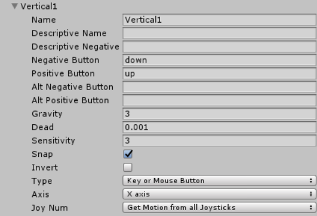
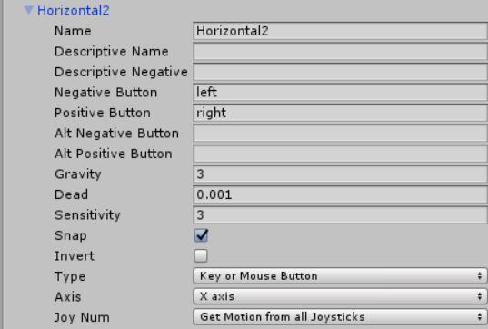
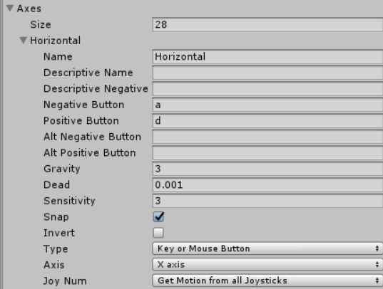
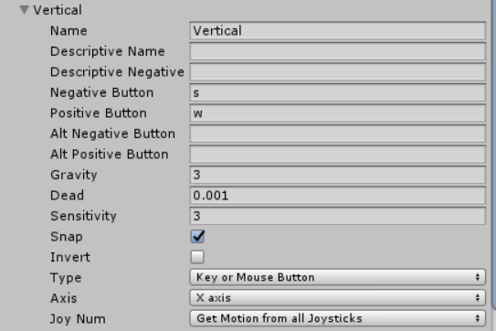
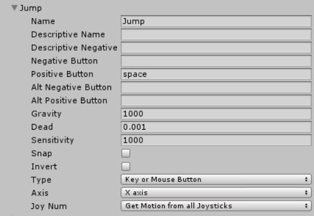
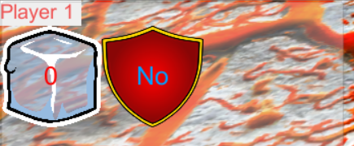
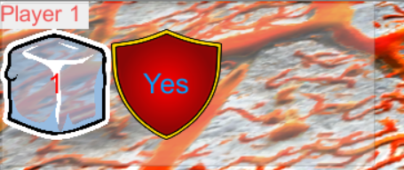
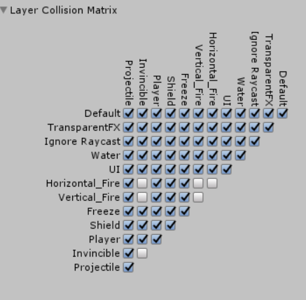

# Implementation of System

## Overview of Implementations

The system was implemented using pre written game 3D characters models called "Gravity Guy" that was provided to us at the start
of the second year Interactive Multi-Media course, these models already came with the scripts implemented, the game was implemented
in the Unity game engine as mentioned in Chapter 2. To implements the various aspects of this I used some pre existing models
from the Unity store for the environment, such as skins for the walls, platforms etc. All other scripts for the in-game 
components were all written and developed by me using the C# programming language.

##Implementation Components

There were several components that needed to be implemented in order to provide a fully functioning game. These included:

* Controller Input
* Graphical Components & Player Display
* Collision Detection
* Projectile System
* Shield System
* Progression

### Controller Input

*Problem*: The Gravity Guy character models already came with a third person controller attached, but I had to make edits
as to accommodate for other players, as if the controls were similar for every player they would all move synchronously as
opposed to independently. I also needed to implement a control for the player who would be controlling the antagonist.

*Implementation*: The input was implemented by copying the original ThirdPersonController.js script that came with the original gravity guy.
Then I changed edited the scripts so that they could be changed in the InputManager that is available within Unity. The
InputManager within Unity can be used to assign different keys to each control that is set on the character when the input
function is called upon.

*Code for player one to call upon InputManager*
```
	var right = Vector3(forward.z, 0, -forward.x);

	var v = Input.GetAxisRaw("Vertical");
	var h = Input.GetAxisRaw("Horizontal");
```
```
    var right = Vector3(forward.z, 0, -forward.x);

    var v = Input.GetAxisRaw("Vertical4");
    var h = Input.GetAxisRaw("Horizontal4");
```

Once this is done you can assign keys to the variables listed through the name they have been given in the input manager
eg "Vertical 4".

**Antagonist Controls**

The four directional arrows up, down left and right are used by the antagonist to move the fireballs.
The fireballs that are laid out horizontally can only move up and down using the up and down arrow keys, while the fireballs
laid out vertically can move left and right using the left and right arrow keys. The public float "speed" is used to control
how fast the enemy can move.
```
using UnityEngine;
using System.Collections;

public class EnemyNav2 : MonoBehaviour
{
    public float speed = 6.0F;
    public float gravity = 20.0F;
    private Vector3 moveDirection = Vector3.zero;
    void Update()
    {
        CharacterController controller = GetComponent<CharacterController>();
        if (controller.isGrounded)
        {
            moveDirection = new Vector3(Input.GetAxis("Horizontal1"), 0, Input.GetAxis("Vertical1"));
            moveDirection = transform.TransformDirection(moveDirection);
            moveDirection *= speed;

        }
        moveDirection.y -= gravity * Time.deltaTime;
        controller.Move(moveDirection * Time.deltaTime);
    }
}
```


```
using UnityEngine;
using System.Collections;

public class EnemyNav3 : MonoBehaviour
{
    public float speed = 6.0F;
    public float gravity = 20.0F;
    private Vector3 moveDirection = Vector3.zero;
    void Update()
    {
        CharacterController controller = GetComponent<CharacterController>();
        if (controller.isGrounded)
        {
            moveDirection = new Vector3(Input.GetAxis("Horizontal2"), 0, Input.GetAxis("Vertical2"));
            moveDirection = transform.TransformDirection(moveDirection);
            moveDirection *= speed;

        }
        moveDirection.y -= gravity * Time.deltaTime;
        controller.Move(moveDirection * Time.deltaTime);
    }
}
```

Then once I completed that code and called the function "Input.GetAxis(Vertical1)", Vertical one now shows up in my input manager
and the up and down keys are assigned to it to make the characters go up and down. The same is then done for where I called
"Horizontal2" and the left and right keys are assigned to make the enemy to be able to move left and right.
(See Figures \ref{enemyinput}, \ref{enemyinput2})





**Protagonist Controls**

The protagonist can run, jump and fire projectiles at other protagonists in order to hindrance them.
While the protagonists all share similar scripts, the controls had to be altered slightly so that one key would not make all the
players move in sync with each other. As explained earlier I did this through the InputManager, and assigned different 
keys to each players particular movement. (See Figures \ref{player1input}, \ref{player1input2}, \ref{player_input3})







As you can see from the figures above, the controls for player 1 are "a" moves him left, "d" moves him right, "s" moves him
down, "w" moves him up and the space bar makes him jump.

Each player can also fire a projectile when it is picked up, unlike the previous controls this one is hardcoded into the code
for convenience purposes because I needed it to comply with a public bool that was set up. So that if the player is able to fire
their projectile, they can press the "tab" key to do so.

```

        if (Input.GetKeyDown("tab") && canFire == true)
            IsFiring();
        playerDisplay.UpdateBlue();
```

## Graphical Components & Player Display

*Problem*: Nowadays a lot of games are sold on their graphics and how the game looks. Graphics are used to represent what is
going on in the game while hopefully catching the players eye while doing so. This includes the in game scenery and user 
inputs, collisions with the antagonist and with the items you can pick up should all effect what the user is seeing on screen
at any moment in time.

*Implementation*: A lot of the skins for the in game scenery were got off the unity store and simply applied onto plain cubes and prefabs
I made for the platform and the walls of the platform. As the game is the protagonist players running away from enemy fireballs,
I decided to make the game look like it was set it a lava type environment.

**3D Objects**
3D objects included in this game are of course; the players, the platform, the walls for the platform, the pickups that spawn into
the game, the antagonist's fireballs and the projectiles that are fired at other players.
These are all implemented using in game objects and then applied using pre-rendered skins from the Unity Store.
The pickups that are used in game are designed to only spawn in every few seconds. There are two type of pickups in game, the first
being an "Ice Blast" you can pick up and then stun your enemy when you fire it at them in the form of a projectile(as mentioned
before). The second pickup available is a shield, which makes you immune to all enemmy damage for 10 seconds after it is picked up.

*Code to spawn in pickup blocks*
```
using System.Collections;
using System.Collections.Generic;
using UnityEngine;

public class spawnBlock : MonoBehaviour {

    public GameObject freeze_Block;
    public GameObject shield_Block;
    public Transform canvas;
    int spawnNum = 1;

    void SpawnFreeze()
    {
        for(int i=0; i<spawnNum; i++)
        {
            SpawnFreezeBlock();
        }
    }

    void SpawnShield()
    {
        for (int i = 0; i < spawnNum; i++)
        {
            SpawnShieldBlock();
        }
    }

    // Use this for initialization
    void Start () {
        SpawnFreeze();
        SpawnShield();
		
	}

    public void SpawnOneBlockAfterDelay(int delaySeconds)
    {
        Invoke("SpawnFreezeBlock", delaySeconds);
        Invoke("SpawnShieldBlock", delaySeconds);
    }

    public void SpawnFreezeBlock()
    {
        Vector3 blockPos = new Vector3(canvas.position.x + Random.Range(-5.0f, 7.5f),
                                       canvas.position.y + Random.Range(2.6f, 2.6f),
                                        canvas.position.z + Random.Range(6.5f, -6.6f));
        Instantiate(freeze_Block, blockPos, Quaternion.identity);
    }

    public void SpawnShieldBlock()
    {
        Vector3 blockPos = new Vector3(canvas.position.x + Random.Range(-5.0f, 7.5f),
                               canvas.position.y + Random.Range(2.6f, 2.6f),
                                canvas.position.z + Random.Range(6.5f, -6.6f));
        Instantiate(shield_Block, blockPos, Quaternion.identity);
    }

}

```

This code spawns one of each blocks after a certain number of time has passed. It will also spawn them within a range that is located 
on the platform as defined in both the "SpawnFreezeBlock()" and "SpawnShieldBlock()" methods.

**Player Display**
The players display is used to show the player(s) how much time is remaining in the level and if they have any pickups 
equipped. Every time a player collides with a block their display will update to show that they have picked up block. If the
user currently has a shield picked up the shield display will turn from yes to no and if a player pick up an ice blast it will 
add one to their inventory that can then be fired as a projectile.

*Player Display Code*
```
using System.Collections;
using System.Collections.Generic;
using UnityEngine;
using UnityEngine.UI;

public class PlayerDisplay : MonoBehaviour {
    public Text textBlue;
    public Text textRed;

    private PlayerManager player;

    private void Awake()
    {
        player = GetComponent<PlayerManager>();
    }

    public void UpdateBlue()
    {
        textBlue.text = "" + player.GetBlueTotal();
    }

    public void UpdateRed()
    {
        textRed.text = "No" + player.GetRedTotal();
    }

}

```

Code that updates Ice Blast

```
  blueTotal++;
  playerDisplay.UpdateBlue();
  Update();
```

Code that updates shield

```
 playerDisplay.UpdateRed();
 SetInvincible();
```

```
public void SetInvincible()
    {
        isInvincible = true;
        CancelInvoke("SetDamagable");
        Invoke("SetDamagable", invincibleTime);
        redNo.text = " ";
        redYes.text = "Yes";
    }
```

```
    void SetDamagable()
    {
        isInvincible = false;
        gameObject.tag = "Player";
        gameObject.layer = 12;
        redYes.text = "No";
    }
```

So if a red block is picked up it activates the shield and changes the text from "No" to "Yes" and then invokes the method 
"SetDamagable()" after a certain time. Once this is invoked the text will change back to "No".






**Collision Detection System**

*Problem*: To define when in the system there is a collision between two in game objects, whether it be the player and the 
fireballs, the player and a projectile etc. The system has to recognise when a collision takes place and there must be different reactions
depending on what objects are colliding.

*Implementation*: Unity is a very good engine for making it simple and convenient for picking up when two objects should 
 interact after a collision. This is done by making sure that the "Is Trigger" option is ticked on whatever collider component
has been selected.

There are many different collider options that take place within this level. Being the pickups and when a player gets hit by the enemy,
when a player gets hit by a projectile. With the pickups it must recognize when a player first makes contact with the block which
will activate this ability.

*Code for pickup abilities*

```
 public void OnTriggerEnter(Collider other)
    {
        if (other.CompareTag("Blue"))
        {
            Destroy(other.gameObject);
            blockSpawner.SpawnOneBlockAfterDelay(timeBetweenBlueSpawns);
            blueTotal++;
            playerDisplay.UpdateBlue();
            Update();
            print("Blue Total Equals" + blueTotal);
        }

        if (other.CompareTag("Red"))
        {
            gameObject.tag = "Invincible";
            gameObject.layer = 13;
            Destroy(other.gameObject);
            blockSpawner.SpawnOneBlockAfterDelay(timeBetweenRedSpawns);
            playerDisplay.UpdateRed();
            SetInvincible();
        }
```
This is done through different tags that have been given to the blocks, "Blue" being for the ice block and "Red" being for the
shield block. Once a block is collided with it is destroyed then activates whichever method is defined within the blocks code.
So when a blue block is collided with it will destroy the blue block, add one to the total number of blue blocks collected,
update the players display and then call on the method "Update()" which we will talk about later when talking about the projectile
system in game. When the red block is collided with it changes both the players tag and their layer. This is done to activate
the invincibility on the player so enemy blocks will not destroy any object with the tag "Invincible" and will not collide or
interact with anything that has the layer of "13", this is done through the "Layer Collision Matrix" (See Figure \ref{collision}).
It will then destroy the red block and call upon the method "SetInvincible()".

*SetInvincible method*

```
    public void SetInvincible()
    {
        isInvincible = true;
        CancelInvoke("SetDamagable");
        Invoke("SetDamagable", invincibleTime);
        redNo.text = " ";
        redYes.text = "Yes";
    }
```

This code then sets the public bool for the player being invincible. It will then invoke the method "SetDamagable" after a certain amount
of time has passed.

*SetDamagable method*
```
    void SetDamagable()
    {
        isInvincible = false;
        gameObject.tag = "Player";
        gameObject.layer = 12;
        redYes.text = "No";
    }
```
This method will get called after the player is not invincible anymore and will set the player back to layer 12 and set the players tag
back to "Player" so they can be destroyed again.

When a player collides with an enemy the player object will be destroyed.

*Enemy kills player script*
```
    void OnTriggerEnter (Collider hit)
    {
        if (hit.CompareTag("Player"))
        {
            PlayerManager playerManager = hit.gameObject.GetComponent<PlayerManager>();
            if (!playerManager.isInvincible)
            {
                Destroy(hit.gameObject);
            }
        }
    }
```

This code is placed on the fireballs and if the fireballs collide with an in game object with the tag of "Player" it will destroy
that object, unless the the bool in the player manager is set to "isInvicible".

When a player collides with a projectile it must freeze them in place. To accomplish this I had the projectile set to a trigger
so when in collided with a game object with a certain tag it would disable the "Player Controller" component on the player.

*Script on projectile to freeze player*

```
public void SetFreeze()
    {
        CancelInvoke("Unfreeze");
        this.GetComponent<CharacterController>().enabled = false;
        Invoke("Unfreeze", freezeTime);
    }
```

*Method which unfreezes player*

```
    void Unfreeze()
    {
        this.GetComponent<CharacterController>().enabled = true;
    }
```



##Projectile System

*Problem*: To add another feature to the game so that there wasn't solely one pickup to the game that would benefit players.

*Implementation*: To give the game more depth I decided to add a small inventory system, along with a projectile that could be fired
while the player had the right pickup in their inventory.

So to attempt and give one player an advantage over another for a short period of time, I decided to add a projectile that would
freeze a player in place once it hits them. The main problem to try and overcome while coding this section was getting the inventory system to
work effectively so that if a player had no items picked up, they could not fire their projectile.
To start off with this system I added some game objects being the bullet and a weapon, a public bool which when activated meant that the player could fire
their weapon and finally a float which would determine how fast the projectile would travel.

*Public gameobjects, bool and float*
```
    public GameObject weapon;
    public GameObject bullet;
    public bool canFire = false;
    public float Bullet_Foward_Force;
```

Then in the update method I defined that if the total of blue blocks picked up is equal or less than 0 the "canFire" bool
is set to false, but if it is greater than 0 the bool is set to true.
From there if the tab key is pressed it fires activates the "IsFiring()" method and the "UpdateBlue()" method found in 
"PlayerDisplay" class.

*Update method*

```
    public void Update()
    {
        if (blueTotal > 0)
            canFire = true;
        if (blueTotal <= 0)
            canFire = false;

        if (Input.GetKeyDown("tab") && canFire == true)
            IsFiring();
        playerDisplay.UpdateBlue();
    }
```

Once the "isFiring()" method is activated it checks if the total number of blue blocks picked up is great than 0 and if it
is it sets the "canFire" bool to true and takes one away from the total every time it is called. From there you then instantiate
the bullet, which creates a clone of the prefab in the game.
The next line of code retrieves the Rigidbody component and the bullet is told to be pushed forward by whatever is set in
the public float.

*Is firing method*

```
    public void IsFiring()
    {
        if (blueTotal > 0 && canFire == true)
           blueTotal--;
        GameObject Temporary_Bullet_Handler;

        Temporary_Bullet_Handler=Instantiate(bullet, weapon.transform.position, weapon.transform.rotation);
        Temporary_Bullet_Handler.transform.Rotate(Vector3.left * 90);

        Rigidbody Temporary_RigidBody;
        Temporary_RigidBody = Temporary_Bullet_Handler.GetComponent<Rigidbody>();
        Temporary_RigidBody.AddForce(transform.forward * Bullet_Foward_Force);

        if(blueTotal ==0)
        {
            canFire = false;
        }

    }
```